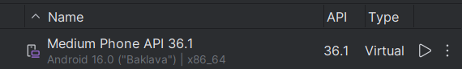

# application_iot

A new Flutter project.

## Getting Started

This project is a starting point for a Flutter application.

A few resources to get you started if this is your first Flutter project:

- [Lab: Write your first Flutter app](https://docs.flutter.dev/get-started/codelab)
- [Cookbook: Useful Flutter samples](https://docs.flutter.dev/cookbook)

For help getting started with Flutter development, view the
[online documentation](https://docs.flutter.dev/), which offers tutorials,
samples, guidance on mobile development, and a full API reference.

## Hướng dẫn nhanh (chạy trên Android giả lập)

- **Yêu cầu:**: Cài Flutter, Android SDK / Android Studio, một Android emulator (có Google Play nếu cần FCM).
- **Chuẩn bị:**: Đảm bảo file `android/app/google-services.json` có trong dự án nếu dùng Firebase.

- **Cài phụ thuộc:**

```powershell
cd path\to\application_iot
flutter pub get
```

- **Khởi động giả lập:**

```powershell
# Liệt kê emulator có sẵn
flutter emulators
# Hoặc khởi chạy emulator (ví dụ):
flutter emulators --launch <EMULATOR_ID>
# Kiểm tra thiết bị đang kết nối
flutter devices
```

- **Chạy app trên giả lập:**

Đây là thiết bị đang chạy ổn định trên giả lập.
```powershell
# Thay `emulator-5554` bằng id từ lệnh `flutter devices` nếu khác
flutter run -d emulator-5554
```

- **Lưu ý ngắn:**
	- Nếu app dùng FCM (push), hãy dùng emulator image có Google Play / Google APIs để nhận token.
	- Nếu gặp lỗi build liên quan đến Gradle/Android, chạy `flutter clean` rồi `flutter pub get` và thử lại.
	- Để test thiết bị ảo mô phỏng IoT, chạy `tool/iot_simulator.dart` hoặc `tool/iot_simulator_enhanced.dart` theo hướng dẫn trong file tương ứng.

Nếu muốn, tôi có thể thêm phần hướng dẫn chi tiết triển khai Firebase hoặc tạo script khởi động giả lập tự động.
